<div align="center" markdown=1>

# Learners

Learners is a web framework originally built by the International Atomic Energy Agency (IAEA) and the Austrian Institute of Technology (AIT) to facilitate training courses, with a specific focus on information and computer security.

It provides participants with a unified interface to access presentations, workbooks, cyber range environments, quizzes, and supporting tools. Instructors can easily manage the learning environment and monitor progress.

Learners is specifically designed to operate with minimal infrastructure requirements and without any associated software costs. This enables the seamless creation, sharing, remixing, and delivery of training courses on a wide scale.

[Features](#features) •
[How it Works](#how-it-works) •
[License](#license)

[Installation](#installation) •
[Configuration](#configuration) •
[Creating a Course](#creating-a-course) •
[Writing Content](#writing-content) •
[Delivering Courses](#delivering-courses)

</div>

## Features


* Exercises are created using Markdown, images, and diagrams.net file formats, making it **free of licensing costs** for office suites.
* Learners supports the simultaneous **delivery of training in multiple languages**, allowing for multilingual instructional content to be provided.
* Learners is designed with self-paced exercise control in mind, allowing participants to **independently perform exercises and receive feedback**.
* The application **embeds HTML5 VNC sessions** to facilitate access to cyber range environments and seamless integration of exercise control allowing participants to trigger injects from within digital workbook.
* Learners generates workbooks **tailored to each role and participant**.
* Course designers can develop **knowledge retention quizzes** to occur during presentations, enhancing learner engagement and interaction while removing the need for costly clickers or in-venue internet access.
* Instructors can seamlessly view **instructor guides** and **monitor participant progress and evaluate answers in real-time**, enabling timely and effective evaluation during the training process.

## How it Works

Learners is a three-part framework that consists of the following modules:

* Learners Application: this is the heart of the framework and combines the created content in the central user interface, handles authentication, fills and maintains the database and serves as an interface to other tools.
* Learners Theme: the theme is used to style the exercise content and to provide the mentioned shortcodes, but it is also the interface for the communication with the learners backend.
* Exercise Content: the exercise information as well as any documentation can be written as markdown files. Various shortcodes can be used to extend its functionality and improve its rendered output (see [Writing Content](#writing-content) for details).

<!-- TODO: Uncomment and add Venjix details :: When combined with Venjix, Learners can be utilized to deliver self-paced exercises for computer security workshops. In this setup, Venjix assumes the responsibility of conducting automated checks on the IT infrastructure to assess correct completion of hands-on tasks on the cyber range environment. -->

## Installation

Learners runs on most major platforms that support python3.

<details markdown=1>
<summary>Docker</summary>

The easiest and fastest way to deploy Learners is by using the docker-compose file included in the main **learners repository.**

1. Ensure that Docker (see [official installation guide](https://docs.docker.com/engine/install/)) is properly installed and running.

2. Clone exercises repo

    ```sh
    git clone https://github.com/iaeaorg/learners.git <target-directory>
    cd <target-directory>
    ```

3. Run docker compose

    ```sh
    cd docker
    docker-compose -f compose.yml up
    ```

Misc:

* SSL certificates will be generated automatically unless you place your own in `docker/ssl/` as `learners.(crt|key)`
* Database:
  * In order to backup the database, copy the .db file at `docker/learners-data/data.db`
  * To provide an already existing database copy it to: `docker/learners-data/data.db` (before running the docker-compose command)
  * To reset the database simply delete `docker/learners-data/data.db` and restart the server

</details>

<details markdown=1>
<summary>Develop</summary>

Clone the **Learners Application** repository

```sh
git clone git@github.com:iaeaorg/learners.git
cd learners
```

Create a virtual env and install all dependencies for learners backend:

```sh
python3 -m venv env
source env/bin/activate
pip install -e .
```

Start the backend via gunicorn on localhost (port 5000):

```sh
gunicorn backend:app --worker-class gevent --bind 0.0.0.0:5000
```

Install all dependencies for the frontend:

```sh
cd frontend
yarn install
```

Start the frontend on localhost (port 3000):

```sh
yarn dev
```

</details>

## Configuration

The configuration file `config.yml` is written in YAML and provides various settings and options to customize the appearance, functionality, and behavior of the Learners application to meet specific requirements and preferences.

<details markdown=1>
<summary>Configuration File Description</summary>

* **learners** (Map):
  * *theme* (Str): The theme for learners, determining the appearance of the learning interface e.g. "dark", "light".
  * *landingpage* (Str): The initial page participants will be directed to upon logging in e.g. "documentation", "exercises", "presentations", "novnc".
  * *language_code* (Str): The default language code for learners, specifying the language used in the user interface e.g. "en", "es".
  * *upload_folder* (Str): The folder where user uploaded files are stored.
  * *upload_extensions* (Seq(Str)): The allowed file extensions for uploads, ensuring only specific file types can be uploaded e.g. "txt", "pdf", "png".

* **jwt** (Map):
  * *jwt_secret_key* (Str): The secret key used for JSON Web Token (JWT) authentication.
  * *jwt_access_token_duration* (Int): The duration of JWT access tokens in minutes. After this period, the tokens expire and require renewal.
  * *jwt_for_vnc_access* (Bool): A true/false flag indicating whether JWT is required for VNC (Virtual Network Computing) access.

* **database** (Map):
  * *db_uri* (Str): The URI (Uniform Resource Identifier) specifying the connection details for the database e.g. "sqlite:///data.db".

* **users** (MapPattern):
  * (Str): User identifier.
    * *password* (Str): The password associated with the user.
    * *admin* (Bool): A true/false flag indicating whether the user has admin privileges.
    * *role* (Str): The role of the user, determining additional access rights and permissions e.g. "instructor".
    * *vnc_clients* (MapPattern):
      * (Str): VNC client identifier.
        * *target* (Str): The target destination for the VNC client.
        * *tooltip* (Str): The tooltip text displayed when interacting with the VNC client.
        * *server* (Str): The VNC server associated with the client.
        * *username* (Str): The username used for VNC client authentication.
        * *password* (Str): The password used for VNC client authentication.

* **venjix** (Map):
  * *auth_secret* (Str): The authentication secret used for Venjix.
  * *url* (Str): The URL pointing to the location of Venjix.

* **callback** (Map):
  * *endpoint* (Str): The endpoint URL for callbacks, specifying the location where callback requests are sent.

* **novnc** (Map):
  * *server* (Str): The server associated with NoVNC, a VNC client implemented using HTML5 technologies.

* **statics** (Map):
  * *directory* (Str): The directory where static files (built once rather than duplicated for each role) are located.
  * *serve_mode* (Str): The serve mode for static files, determining how static content is served to users e.g. per "role" or "user".

* **staticsites** (Seq(Map)):
  * *url* (Str): The URL for a static site, specifying its web address.
  * *id* (Str): The ID for a static site, providing a unique identifier for reference.
  * *title* (Str): The title of a static site, describing its purpose or content.
  * *icon* (Str): The icon associated with a static site, representing it visually.

* *serve_documentation* (Bool): A true/false flag indicating whether to build documentation content and represent it visually in Learners.
* *serve_presentations* (Bool): A true/false flag indicating whether to build presentation content and represent it visually in Learners.
* *serve_exercises* (Bool): A true/false flag indicating whether to to build exercise content and represent it visually in Learners.
* *exercise_json* (Str): The path to the hugo generated JSON file containing exercise data.

</details>

## Creating a Course

A training course lives from the content of the exercises. Learners supports facilitating the creation of exercises for the trainers and to make them available to the participants in an appealing way.

### Preparation of an Environment for Creating the Exercise Content

<details markdown=1>
<summary>Linux</summary>

Install hugo. Unfortunately, this is only possible to a limited extent via the apt manager (see [hugo install docs](https://gohugo.io/installation/linux/)), so we recommend installing via the [snap](https://gohugo.io/installation/linux/#snap) package manager or via direct download of a current [release](https://github.com/gohugoio/hugo/releases) (at least version 102 (extended)).

```bash
sudo apt install snapd
sudo snap install hugo
```

</details>

<details markdown=1>
<summary>Windows</summary>

On the Windows platform we recommend the use of the [Chocolatey Package Manager](https://docs.chocolatey.org/en-us/choco/setup)  or download the windows release via direct download of a current [release](https://github.com/gohugoio/hugo/releases) (at least version 102 (extended)):

1. open cmd with admin privileges

2. Run the following command (obtained from [Chocolatey install page](https://chocolatey.org/install)):

    ```cmd
    Set-ExecutionPolicy Bypass -Scope Process -Force; [System.Net.ServicePointManager]::SecurityProtocol = [System.Net.ServicePointManager]::SecurityProtocol -bor 3072; iex ((New-Object System.Net.WebClient).DownloadString('https://community.chocolatey.org/install.ps1'))
    ```

3. Verify your installation:

    ```cmd
    choco -?
    ```

4. After installing chocolatey, execute the following command:

    ```cmd
    choco install hugo-extended
    ```

</details>

### Building Pages in Learners

One of the main intentions of learners is to facilitate the creation of exercises for instructors to the extent that little technical knowledge is required.

Learners allows an instructor to write the exercises and validate them with the help of Hugo in a live preview of the current state. You can see the result as it will be displayed in the productive system.

The used file format is [markdown](https://daringfireball.net/projects/markdown/) that are rendered into static HTML files. Accordingly, the creator has the common markdown ([goldmark](https://github.com/yuin/goldmark) parser) syntax at his/her disposal. In addition, raw HTML can be included and the predefined shortcodes can be used.

The shortcodes provided by learners include components that are necessary to communicate with the learners-backend as well as additional functionalities and extensions for markdown to make the creation of content easier and more flexible. A complete list of applicable shortcodes can be found here ([Writing Content](#writing-content)).

<details markdown=1>
<summary>Previewing Exercises</summary>

The theme is included as a git submodule, if you want to run the preview without using the full docker deployment, use the command `git submodule update --init --recursive` to initialize and fetch the submodule content.

To get this live view, simply run the following command from the root directory of the exercises repo:

```bash
hugo serve
```

Subsequently, you can view the rendered version at [http://localhost:1313](http://localhost:1313) (by default) in the web browser.

When you change the content, the preview is updated automatically.

***Note:*** *For major changes, the Hugo server may have to be completely restarted and/or the browser cache cleared to actually display the current content (e.g. when changing shortcodes or conducting structural changes).*

After the dev environment has been set up, the content can be created/edited. For this, an IDE such as [vscode](https://code.visualstudio.com/) is recommended that supports the Hugo language and syntax, but strictly speaking, any kind of text editor can be used since [markdown](https://daringfireball.net/projects/markdown/) is a pure text file.

</details>

<details markdown=1>
<summary>Directory Structure</summary>

As already mentioned, all content files are located in the folder of the same name. Within this folder lie all content files that will be served by the hugo server. By default there are two further folders `documentation` and `exercises`.

The folder is structured as follows:

```bash
.
├── documentation                            # holder of all documentation files
│   ├── _index.<language-code>.md            # landingpage (introduction)
│   ├── <menu-item>                          # each menu item must be contained inside its own folder
│   │   ├── _index.<language-code>.md        # each menu item must at least have one index markdown file
│   │   └── _index.<language-code>.md        # additional languages must have a separate index file 
│   └── <menu-item>                          # with the corresponding language code
│   .   └── _index.<language-code>.md        
│   .   
│   .   
└── exercises                                # holder of all exercises files
    ├── _index.<language-code>.md            # landingpage (introduction)
    ├── <menu-item>                          # each menu item must be contained inside its own folder
    │   ├── _index.<language-code>.md        # each menu item must at least have one index markdown file
    │   └── _index.<language-code>.md        # additional languages must have a separate index file 
    └── <menu-item>                          # with the corresponding language code
    .   └── _index.<language-code>.md        
    .
    .
```

Each content file follows certain structural and nominative rules. A content file is always called `_index.<language-code>.md`. Other names can also be used, but the index files are always used as landing pages of the corresponding subfolders. However, it may be useful to use a different name and then refer to it within the index file.

The language code (e.g. `en` for english or `es` for spanish) gives the possibility to switch between the languages.

Each index file consists of two parts:

* Page Parameters
* Page Content

</details>

<details markdown=1>
<summary>Creating a New Content Page</summary>

When creating content, one must adhere to the prevailing structures in order to achieve the desired result. The files of the "content" folder is relevant for creating content. The subfolders primarily include "documentation", "exercises" and "presentations" which each represent the corresponding content of the associated learners tabs (these are rendered separately in production and assigned to them).

In order to create new items in the main menu:

1. Create a new folder in the content-root-folder (e.g. exercises)
2. Add an `_index.md` containing the information for the menu item (further details and options can be found here ([structure](#structure)).
3. (optional) Further menu sub-items are created in the same way.

***Note:** The `_apps` folder also has a special role. In this folder, additional static content can be placed that can be made available to the content and thus ultimately to the participants (e.g. static websites as a resource for an exercise).

**Page Parameters:**

>* **title**<br>
  The title defines the name of the page and is displayed as a large h1 headline at the beginning of the page.
>* (optional) **menuTitle**<br>
  By specifying a menuTitle, for example, a short form or code of the title can be specified which is then displayed in the menu instead.
>* (optional) **weight**<br>
>  used for ordering the contents in the menu. Lower weight gets higher precedence. Values must be non-zero, as 0 is interpreted as an *unset* weight.
>* (optional) **chapter**<br>
>  If set, the page is rendered as a chapter.
>* (optional) **questionnaire**<br>
>  Integrates structured questions and answers for interactive content. Supports multiple `question` entries with predefined answers. Specify `multiple: true` or `false` to allow or disallow multiple selections per question.
>* (optional) **redirect**<br>
>  It may sometimes be the case that the content is to be organised in folders, but that an actual intro/index file cannot be created in each subsequent hierarchy level. In this case, a redirect can be used that forwards the visitor to a subfile.
>* (optional) **hideopts**<br>
>  This parameter can be used to define the display and hiding of content. It can be used to specify when the menu link is clickable. In this way, for example, only the contents of the current and/or previous sessions can be displayed in a training course lasting several days. Specifications can be made as follows (a combination is also possible, simply concatenate both strings):
>   * `until YYYY-MM-DD hh:mm`
>   * `from YYYY-MM-DD hh:mm`

```markdown
---
title: Introduction to the use of Learners 
menuTitle: Learners Intro
weight: 1
chapter: false
hideopts: until 2023-01-01 00:01
---

# Welcome to Learners

Here you will find a guide that leads you through the Learners interface. Learners is the interface that gives you access to this documentation and allows you to access and perform the exercises. It also offers several additional features that are specifically discussed in this guide.
```

</details>

<details markdown=1>
<summary>Creating a "Clicker" Style Questionnaire</summary>

Learners has the ability to create a "clicker" style questionnaire that can managed within the course. Questions are built into a database established from the `questionnaire` parameter in the page settings. This allows for structured questions and answers, facilitating interactive content for the learners. You can specify whether multiple answers are allowed for each question.

Here is an example of how to add a questionnaire to your content page:

```markdown
---
title: Feedback on Learner Experience
menuTitle: Learner Feedback
weight: 2
chapter: false
hideopts: from 2023-01-02 00:01
questionnaire:
  - question: "Out of the groups discussed, which do you best identify as?"
    answers:
      - "Decision Makers"
      - "Implementors"
      - "Impacted"
    multiple: false
  - question: "How long have you worked on nuclear computer security?"
    answers:
      - "<1 year"
      - "2-3 years"
      - "3+ years"
    multiple: false
  - question: "What are you looking forward to building as part of this course?"
    answers:
      - "Engagement"
      - "Confidence"
      - "Empowerment"
    multiple: true
---

# Feedback on Your Learner Experience

This section is dedicated to collecting feedback from learners. Your responses will help us improve the learning experience. An instructor will issue questions to you within the Learners application, please answer them so we can support your learning experience.
```

</details>

### Structuring Content in Learners

While Learners has been designed to be flexible the following sections and features were considered in it's design. The following sections outline briefly their intended use.

<details markdown=1>
<summary>Documentation</summary>

The Learners platform incorporates a dedicated section specifically designed to house essential course-related documentation. Content pages built for documentation should be stored under `/documentation/` and will be generated by default although this behaviour can be disabled in the Learners `config.yml`. Typically included within this section are:

* **Detailed Course Agenda**: Outlining the structured plan and timeline for the course, usually within a Markdown table.
* **User Guide for 'Learners' Platform**: Comprehensive instructions and tips designed to assist participants in navigating and utilizing the 'Learners' platform and the specific functionality enabled for the course.
* **Resource Repository**: A curated collection of valuable materials including cheat sheets for various tools, standards, and guidance documents. These resources are intended to supplement the learning process and provide quick reference points.
* **Course Feedback**: A form page prepared to capture participant feedback on the course.

</details>

<details markdown=1>
<summary>Exercises</summary>

The "Exercises" section in the Learners platform is intended to outline the hands-on training activities, guide the participants through them, and collect their responses and feedback. Content pages built for exercises should be stored under `/exercises/` and will be generated by default although this behaviour can be disabled in the Learners `config.yml`. An exercise content page will typically include:

* **Exercise Descriptions and Objectives**: Each exercise is usually prefaced with a detailed description and clear learning objectives, ensuring that participants understand the purpose and expected outcomes.
* **Step-by-Step Instructions**: Exercises steps should provide easy-to-follow steps, guiding participants through each task. Including images and other resources to support the learning experience.
* **Form Elements**: Interactive form elements allow participants to answer questions or link to other external tools.
* **Links to Resources**: Links can be embedded onto the page to other Learners pages, tools provided in Learners tabs, or applications hosted under the `_apps/` directory.

An example of the structure of a five day training course follows:

```bash
exercises/
├── _index.en.md
├── day_1
│   ├── M-12E
│   │   ├── _index.en.md
│   │   ├── aaea.png
│   │   ├── acbp.png
│   │   ├── acsc.png
│   │   ├── afp.png
│   │   ├── asherah.png
│   │   ├── asis.png
│   │   ├── gula.png
│   │   └── snri.png
│   ├── M-15E
│   │   ├── _index.en.md
│   │   ├── ics_process.png
│   │   └── inst_diagram.png
│   └── _index.en.md
├── day_2
│   ├── M-21E
│   │   ├── _index.en.md
│   │   ├── asis_report.pdf
│   │   ├── cooperzino.pdf
│   │   ├── gula.pdf
│   │   └── nuclear_news.pdf
│   ├── M-23E
│   │   ├── R-23E_Cyber Threat Scenario Analysis Exercise_Trainee.pdf
│   │   └── _index.en.md
│   └── _index.en.md
├── day_3
│   ├── M-31E
│   │   └── _index.en.md
│   ├── _index.en.md
│   └── ics_1
│       ├── _index.en.md
│       ├── control-panel-remote-access.png
│       ├── mmc-disable-fw-rule.png
│       ├── mmc-event-viewer-local.png
│       ├── mmc-logon-information.png
│       ├── mmc-select-computer.png
│       ├── mmc-snap-ins.png
│       ├── mmc-windows-firewall.png
│       ├── run-mmc.png
│       ├── tia-desktop-icon.png
│       ├── tia-open-project.png
│       ├── tia-plc_1-online.png
│       ├── tia-plc_1-open.png
│       └── tia-simulate-process.png
├── day_4
│   ├── M-41E
│   │   ├── _index.en.md
│   │   ├── lozenge.png
│   │   └── sec_levels.png
│   ├── M-42E
│   │   ├── _index.en.md
│   │   ├── example_sec_levels.png
│   │   ├── snri_assigned_functions.png
│   │   ├── snri_complex.png
│   │   ├── snri_opal.png
│   │   └── snri_rrb.png
│   └── _index.en.md
├── day_5
│   ├── M-52E
│   │   └── _index.en.md
│   ├── _index.en.md
│   └── ics_2
│       ├── _index.en.md
│       ├── file-explorer-loc.png
│       ├── ipfire-fw-logs.png
│       ├── ipfire-fw-rules-overview.png
│       ├── ipfire-main-page.png
│       ├── mmc-add-folder-snapin.png
│       ├── mmc-view-shares.png
│       ├── tia-window-title.png
│       ├── ws-clear-df.png
│       ├── ws-cotp-example.png
│       ├── ws-example-df.png
│       ├── ws-lan-start.png
│       ├── ws-smb-filter.png
│       └── ws-stop-capture.png
```

</details>

<details markdown=1>
<summary>Presentations</summary>

The presentations section is designed to provide participants access to presentations in an easy to view and follow format. Learners will embed a PDF on the page and provide a usable interface for the pariticpant to follow on with a lecture or later refer to the presentation material. Content pages built for presentations should be stored under `/presentations/` and will be generated by default although this behaviour can be disabled in the Learners `config.yml`.

The PDF file for presentation can either be stored under the content page directory or centrally in `_slides`, this allows all presentation PDFs to be managed from a central directory allowing scripted generation of all PDFs output to a single directory from their respective source documents (`.pptx`, `.odp`, etc.). If files are stored centrally the `global_slides` flag should be set to `true` in the frontmatter of the content page.

The following is an example of a presentation content page utilising `global_slides` and with a single quiz question:

```markdown
---
Title: M-21 Introduction to Threat and Attack Lifecycle
menuTitle: M-21
weight: 2
chapter: false
slides: "M-21_Intro to Threat and Attack Lifecycle.pdf"
global_slides: true
questionnaire:
  - question: "A potential attacker's capability, intent, and opportunity are independent factors, and the absence of one does not significantly impact the overall threat?"
    answers:
      - "Yes"
      - "No"
    multiple: false
---


```

</details>

<!-- TODO: NoVNC setup
<details markdown=1>
<summary>HTML5 VNC Environment</summary>
</details>
 -->

<details markdown=1>
<summary>Static Applications and External Tools</summary>

Static ressources can be added in the **/_apps** folder in the root directory of this repository. When refering to the files in a hyperlink, add `?target=_apps` to the url.

**Example:**

Add a folder named "example_website" to the_apps folder, and create a default index.html file.

```markdown
[Example Website](example_website/index.html?target=_apps)
```

</details>

## Writing Content

<!-- This section of the README uses example hugo shortcodes, the following liquid code exempts them from Jekyll parsing -->
<!--  -->

### Formatting Content

Markdown simplifies the writing and creation of html content. However, this simplification comes with the drawback of losing control over certain features. We have tried to give back some important capabilities by using shortcodes.

<details markdown=1>
<summary>(layout-table): Using Tables for Formatting</summary>

Sometimes you want to organise the content in a table, e.g. a list of images with the corresponding picture description right next to it. In markdown, however, there is no table without a header and without borders. To achieve this, the following shortcode can be used:

```html

```

This shortcode must be inserted **somewhere within** the table object.

```markdown
|  |                 |
| :--------------------------------- | :-------------- |
|              | lorem ipsum ... |
```

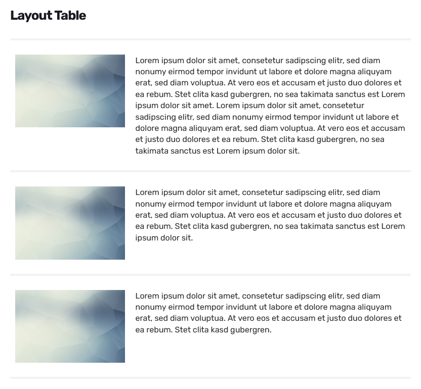

**Options:**:

>* (optional) **divider:** (default: "true")<br>
  The *divider* parameter controls whether or not to display a small border on the lower edge of a table row.
  
```html
  
```

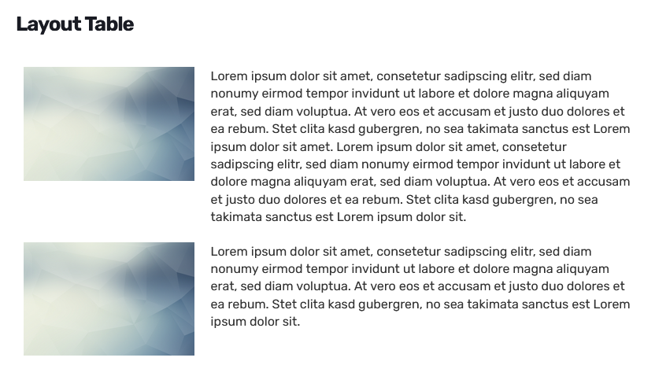

>* (optional) **striped:** (default: "false")<br>
  The *striped* parameter allows shading in every odd table row. It is recommended to deactivate the divider parameter when using this.

```html

```
  
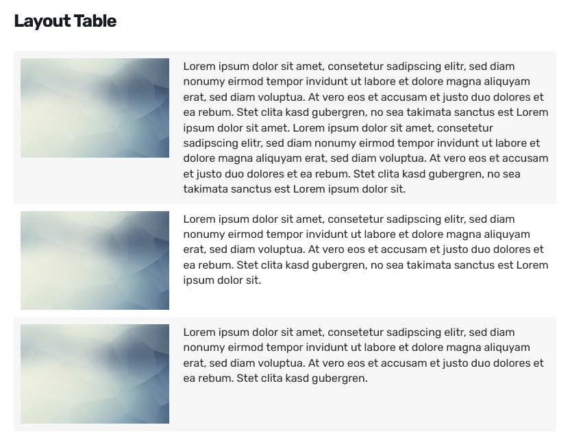

>* (optional) **ratio** (Default: "30 70")<br>
  The *ratio* parameter can be used to control the widths of the columns in a two-column layout. These must always sum up to 100. In the following example, a 50:50 ratio was used:
  
```html

```
  
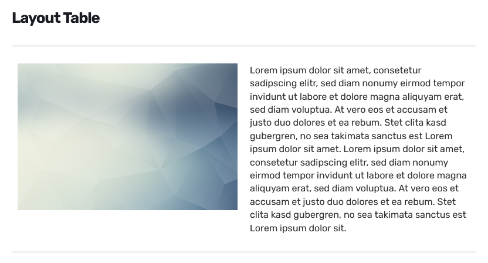

>* (optional) **padding** (default: "10px")<br>
  The padding parameter can be used to control the cell spacing. This option expects a string in the usual CSS syntax.

```html

```

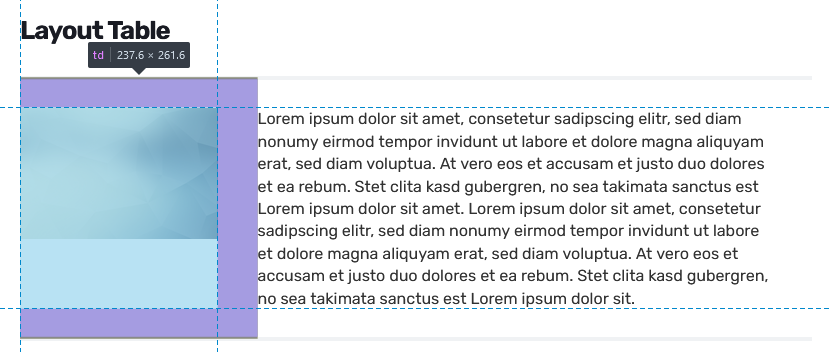

If you want to use a default table and only the header should be hidden, this can be done with the following shortcode:

```html

```

</details>

<details markdown=1>
<summary>(cell-span): Merging Cells in Tables</summary>

Using the cell-span shortcode, row- and col-span can also be realised in markdown.

**Options:**

>* **cols** (default=1)

```html
| Head: first column                 | Head: second column |
| :--------------------------------- | :------------------ |
|  Lorem ipsum ...                |
|             | Lorem ipsum ...     |
```


>* **rows** (default=1)

```html
| Head: first column      | Head: second column                                |
| :---------------------- | :------------------------------------------------- |
|  |  Lorem ipsum ...         |
|  | |
```

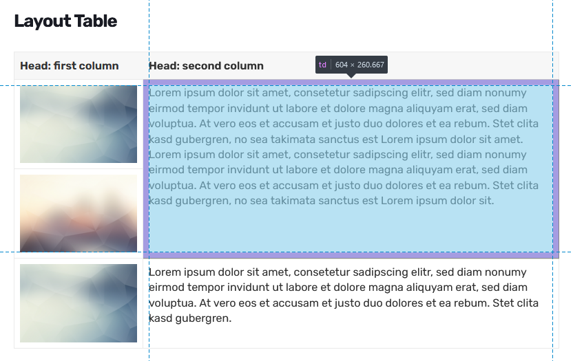

</details>

<details markdown=1>
<summary>(cell|row|col-color): Coloring tables</summary>

The following 3 shortcodes can be used to shade cells, rows and columns respectively. These shortcodes must be placed in the corresponding cells and have the two options that expect a CSS compliant string (HEX or colour enumerates):
>
>* (optional) **color**
>* (optional) **textcolor**

**cell-color:**

```html
|  Lorem ipsum ... | At vero ... |
```


**row-color:**

```html
|  Lorem ipsum ... | At vero ... |
```

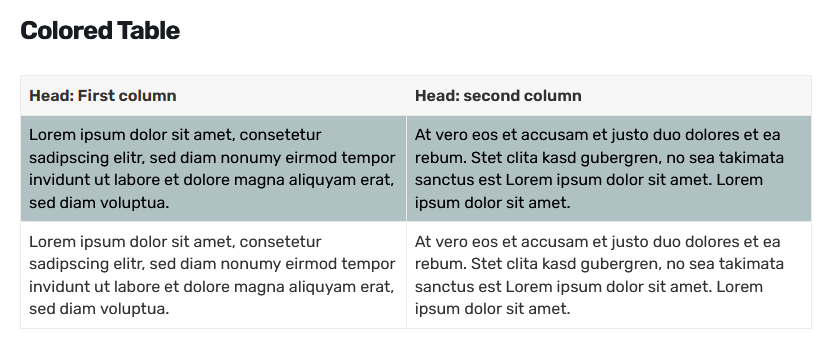

**col-color:**

```html
|  Lorem ipsum ... | At vero ... |
```

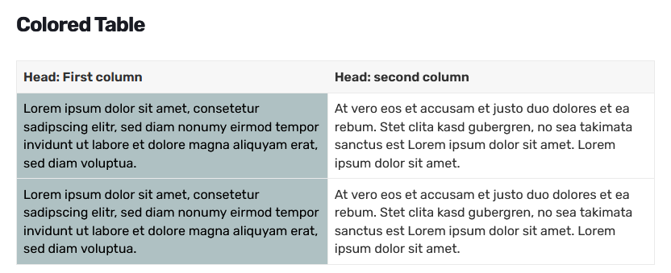

</details>

<details markdown=1>
<summary>Markdown embedding of images and figures</summary>

Images can be included in two ways: either as markdown default, which is rendered to a normal inline img tag, or you can extend the filename with `#figure`, which results in them being displayed uniformly: gray background, dropshadow and a caption below. The numbering of the figure is generated automatically. The alt text is used as caption. This also has the advantage that the raw markdown file can be viewed with any rendering engine without causing rendering glitches.  

**Normal Image:**

```markdown

```


**Figure:**

```markdown

```

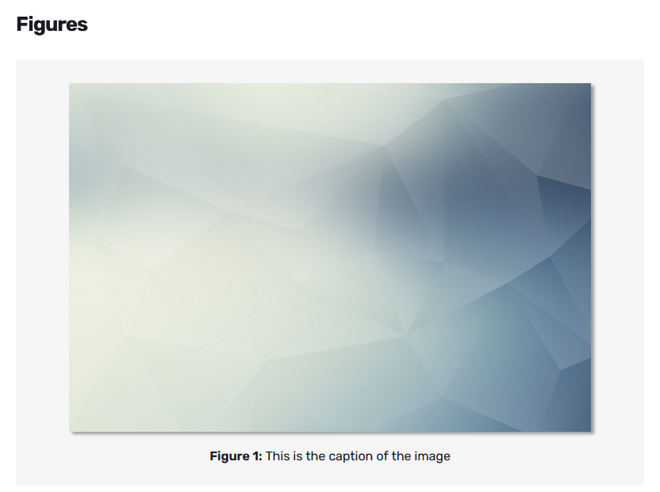

</details>

### Creating Exercise Forms

In order to create a form exercise, you first need a form-shortcode wrapper that includes all the corresponding form fields and a corresponding input-group. These two shortcodes are mandatory.

<details markdown=1>
<summary>(form): Creating exercise forms to accept submissions from participants</summary>

The only parameter required is the form name, which must be unique. If a duplicate name is entered it will return an error with further information (where to find the duplicate) when rendering via hugo.

```markdown
{}
<content>
{}
```

At the end of a form, the so-called **trigger box** is automatically generated, which is used for communication with the Learners backend.

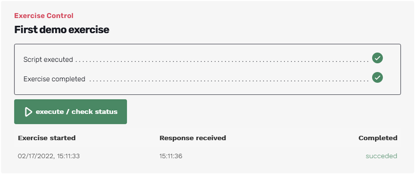
</details>

<details markdown=1>
<summary>(input-group): Grouping of question sets and allowing for extendability e.g. minimum of three answers</summary>

The form fields are organized in groups. So first another wrapper `input-group` must be created in which the individual fields can be defined afterwards:

```markdown
{}
<form elements>
{}
```

**Options:**
>
>* (optional) **title**<br>
  Headline of the respective input group, rendered as headline-html-tag.
>* (optional) **extendable** (default = false)<br>
  If set to true the participants get an additional button 'add row' (see image below) where they can extend the respective group of elements. By clicking this button all fields of the corresponding group are duplicated and attached to the form.
>* (optional) **min** (default: 0)<br>
  Can be used to force a specific number of additional items. e.g. a minimum of 3 OSINT findings must be submitted. If this condition is not met, the form won't be submitted at all.


</details>

#### Form Elements

<details markdown=1>
<summary>(input-text): a simple one-line text field</summary>

```markdown

```

**Options:**
>
>* **label**<br>
  Label for the respective textfield.
>* (optional) **required** (default: false)<br>
  If set to true, the validation fails if it's empty.
>* (optional) **wide** (default: false)<br>
  If set to true, the label and the textfield are displayed in two separate rows. It is recommended to use this option if the label text is very long.
>* (optional) **placeholder**<br>
  Can be used to show a placeholder text inside the textfield.
>* (optional) **instructor**<br>
  Gives the opportunity to give notes to the instructors. This information is only visible for users with the role 'instructor' or 'admin'

Example output:

```markdown

```


</details>

<details markdown=1>
<summary>(input-textarea): an expandable multiline text field for free text</summary>

```markdown

```

**Options:**
>
>* **label**<br>
  Label for the respective textarea.
>* (optional) **required** (default: false)<br>
  If set to true, the validation fails if it's empty.
>* (optional) **wide** (default: false)<br>
  If set to true, the label and the textarea are displayed in two separate rows. It is recommended to use this option if the label text is very long.
>* (optional) **placeholder**<br>
  Can be used to show a placeholder text inside the textfield.
>* (optional) **instructor**<br>
  Gives the opportunity to give nodes to the instructors. This information is only visible for users with the role 'instructor' or 'admin'

Example output:

```markdown

```


</details>

<details markdown=1>
<summary>(input-select): a dropdown selection box with pre-filled choices</summary>

```markdown

```

**Options:**
>
>* **label**<br>
  Label for the respective selection.
>* **options**<br>
Must be given as a semi-colon-separated list.
>* (optional) **default** (default="-- please select --")<br>
Defines the pre-selected option.
>* (optional) **required** (default: false)<br>
  If set to true, the validation fails if it's empty.
>* (optional) **wide** (default: false)<br>
  If set to true, the label and the selection are displayed in two separate rows. It is recommended to use this option if the label text is very long.
>* (optional) **instructor**<br>
  Gives the opportunity to give nodes to the instructors. This information is only visible for users with the role 'instructor' or 'admin'

Example output:

```markdown

```


</details>

<details markdown=1>
<summary>(input-radio): a single choice select list</summary>

```markdown

```

**Options:**
>
>* **label**<br>
  Label for the respective textfield.
>* (optional) **required** (default: false)<br>
  If set to true, the validation fails if it's empty.
>* (optional) **wide** (default: false)<br>
  If set to true, the label and the textfield are displayed in two separate rows. It is recommended to use this option if the label text is very long.
>* (optional) **instructor**<br>
  Gives the opportunity to give nodes to the instructors. This information is only visible for users with the role 'instructor' or 'admin'

Example output:

```markdown

```


</details>

<details markdown=1>
<summary>(input-checkboxes): a multi-choice select list</summary>

```markdown

```

**Options:**
>
>* **label**<br>
  Label for the respective textfield.
>* (optional) **required** (default: false)<br>
  If set to true, the validation fails if it's empty.
>* (optional) **wide** (default: false)<br>
  If set to true, the label and the textfield are displayed in two separate rows. It is recommended to use this option if the label text is very long.
>* (optional) **instructor**<br>
  Gives the opportunity to give nodes to the instructors. This information is only visible for users with the role 'instructor' or 'admin'

Example output:

```markdown

```

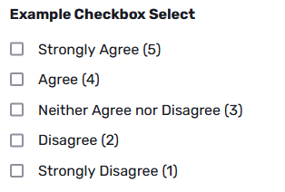

</details>

<details markdown=1>
<summary>(input-table): a editable table</summary>

```markdown

```

**Usage:**

Surround a markdown table with the respective shortcode. Empty cells will be editable. If *autoextend* is activated, the table will delete empty rows and ensure there is a new empty last row.

**Options:**
>
>* **autoextend** (default: false)<br>
  If set to true, the table automatically adds new rows if there is no empty last row.

Example output:

```markdown
{}
| Header1: Left   |         Header2: Center          |   Header3: Right |
| :-------------- | :------------------------------: | ---------------: |
| lorem ipsum ... | lorem ipsum ...                  |  lorem ipsum ... |
| lorem ipsum ... |                                  |                  |
{}
```


</details>

<details markdown=1>
<summary>(input-drawio): a diagram input</summary>

```markdown

```

**Usage:**

First go to [draw.io](https://app.diagrams.net/) and create the template that should be used by the participants. Go to **file - save as - select typ: editable svg** and save it in the respective directory.

**Options:**
>
>* **label**<br>
  Label for the respective exercise.

Example output:

```markdown

```

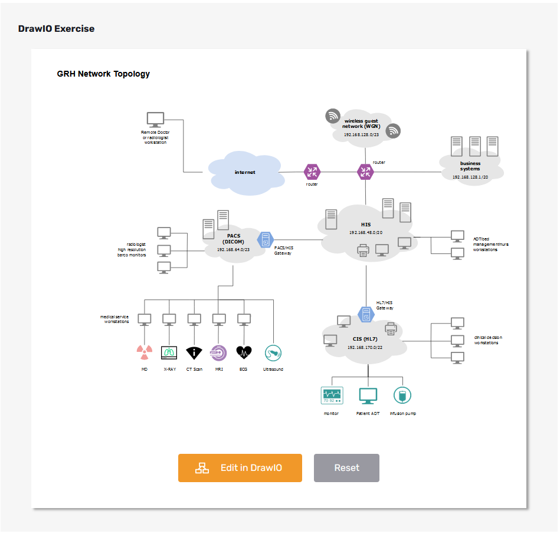

</details>

<details markdown=1>
<summary>(input-file): an element to allow participants to upload a file</summary>

```markdown

```

**Options:**
>
>* **label**<br>
  Label for the respective textarea.
>* (optional) **required** (default: false)<br>
  If set to true, the validation fails if it's empty.
>* (optional) **wide** (default: false)<br>
  If set to true, the label and the textarea are displayed in two separate rows. It is recommended to use this option if the label text is very long.

Example output:


</details>

<details markdown=1>
<summary>(input-risk): A risk calculation for computer security exercises</summary>

A special type of input is the risk input. This consists of 3 components that are automatically integrated. The risk field is calculated automatically depending on what is selected in the other two fields.

```markdown

```

**Options:**
>
>* (optional) **likelihood_label** (default="Likelihood")<br>
  Label for the respective likelihood selection.
>* (optional) **likelihood_options** (default="1 - Remote; 2 - Unlikely; 3 - Possible; 4 - Likely; 5 - Certain")<br>
>* (optional) **impact_label** (default="Impact")<br>
Label for the respective impact selection.
>* (optional) **impact_options** (default="1 - Trivial; 2 - Minor; 3 - Moderate; 4 - Major; 5 - Critical")<br>
>* (optional) **risk_label** (default="Risk as (L x I)")<br>
  Label for the respective risk textfield.
>* (optional) **wide** (default: false)<br>
  If set to true, the label and the selection are displayed in two separate rows. It is recommended to use this option if the label text is very long.

Example output:

```markdown

```


</details>

<details markdown=1>
<summary>(input-comment): A textbox to collect feedback on the Content Page</summary>

A special type of input is the comment input. There are no arguments for the comment input, rather it triggers Learners to render an input box that prompts a course participant to fill in feedback on the specific Content Page.

```markdown

```

Example output:

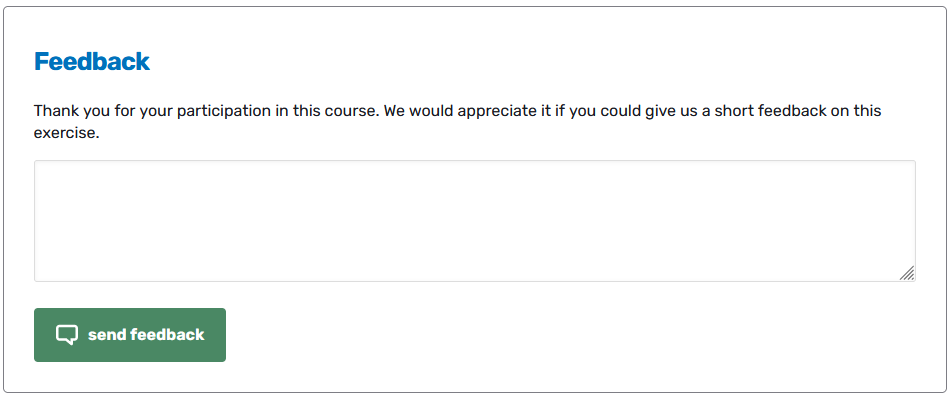

</details>

<!--  -->
<!-- This is closing the raw liquid code opened at the start of the section -->


## Delivering Courses

The primary benefit to delivering courses with Learners is the ability to control the learning environment and review pariticpant progress live. Users granted the admin role will find a special section within Learners upon login. This admin area, designed to support course delivery, is split across several views and allows authorised users to manage course elements, the overall participant experience, and review any submissions from participants in the course.

<details markdown=1>
<summary>Submissions Overview</summary>

The Submissions Overview gathers each user's responses for every exercise. Admins can easily choose any submission to review the participant's answers, download any attatched files, or preview submitted draw.io diagrams.

Example:

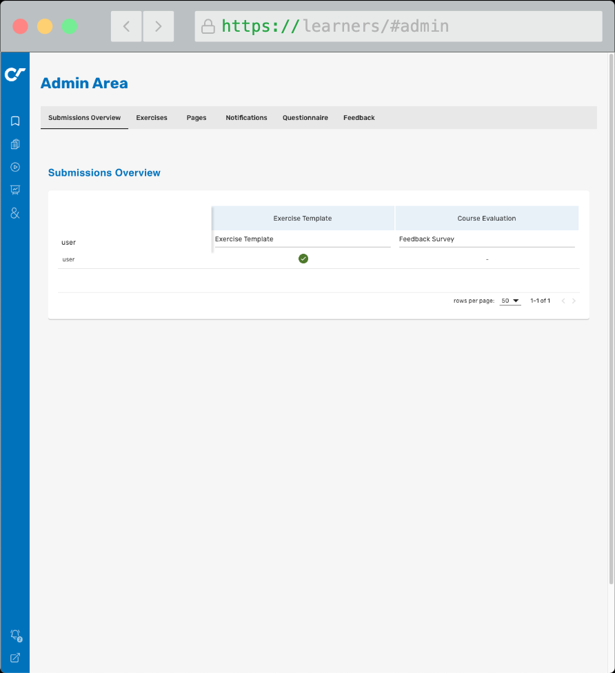

</details>

<details markdown=1>
<summary>Exercises</summary>

The Exercises page provides a summary of submissions for each task within an exercise, differentiating between individual and group activities. It helps in monitoring participant progress and coordinating effectively during extended exercises. For example, instructors can be notified to help participants who are delayed in submitting their responses within the planned timeframe, or to unobtrusively address errors identified in participant responses. Addressing these mistakes promptly can prevent them from impacting the participants' experience in later parts of the exercise or the course.

Example:

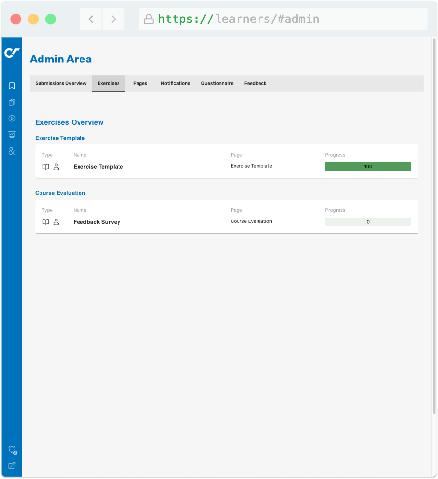

</details>

<details markdown=1>
<summary>Pages</summary>

The Pages view allows toggling the visibility of Exercises, Presentations, and Documentation. This can be useful when developing courses where presentations and exercises are designed to progressively build on one and other.  In such courses, answers to earlier questions are provided or become evident in subsequent course materials. Similarly, certain exercises may include a series of stages or 'injects' that are revealed to participants as the simulated exercise progresses.

Example:

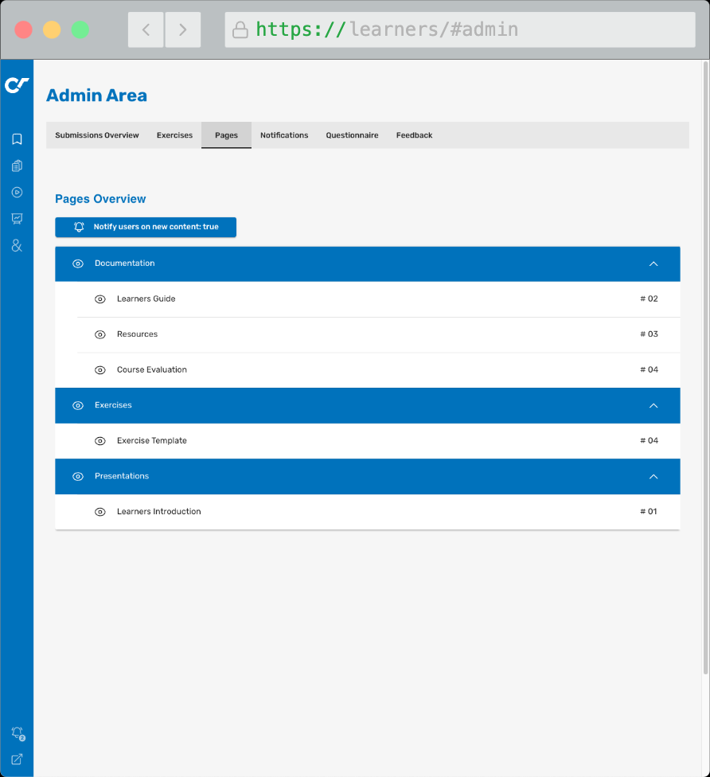

</details>

<details markdown=1>
<summary>Notifications</summary>

The notifications page permits administrators to send messages to individual users, groups, or specific roles. These notifications can be pre-set in the Learner's config.yml file or added by an administrator during a course. They appear as pop-up alerts on the recipients' view of the Learners website. This feature is particularly valuable for informing participants about logistical details of the course or for delivering injects during an exercise.

Example:

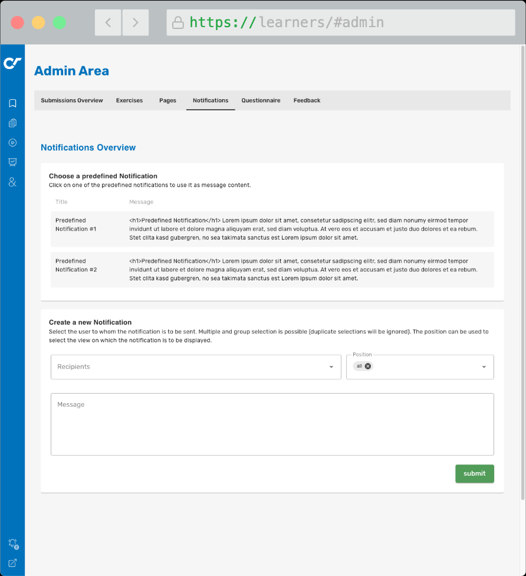

</details>

<details markdown=1>
<summary>Questionnaire</summary>

The Questionnaire page enables course administrators to send multiple-choice questions that appear on the participants' screens and gather their responses. Administrators can dispatch questions that are pre-defined in the course materials' frontmatter, monitor the progress of participant submissions, and subsequently present the results in a pie chart format.

Questionnaire page:

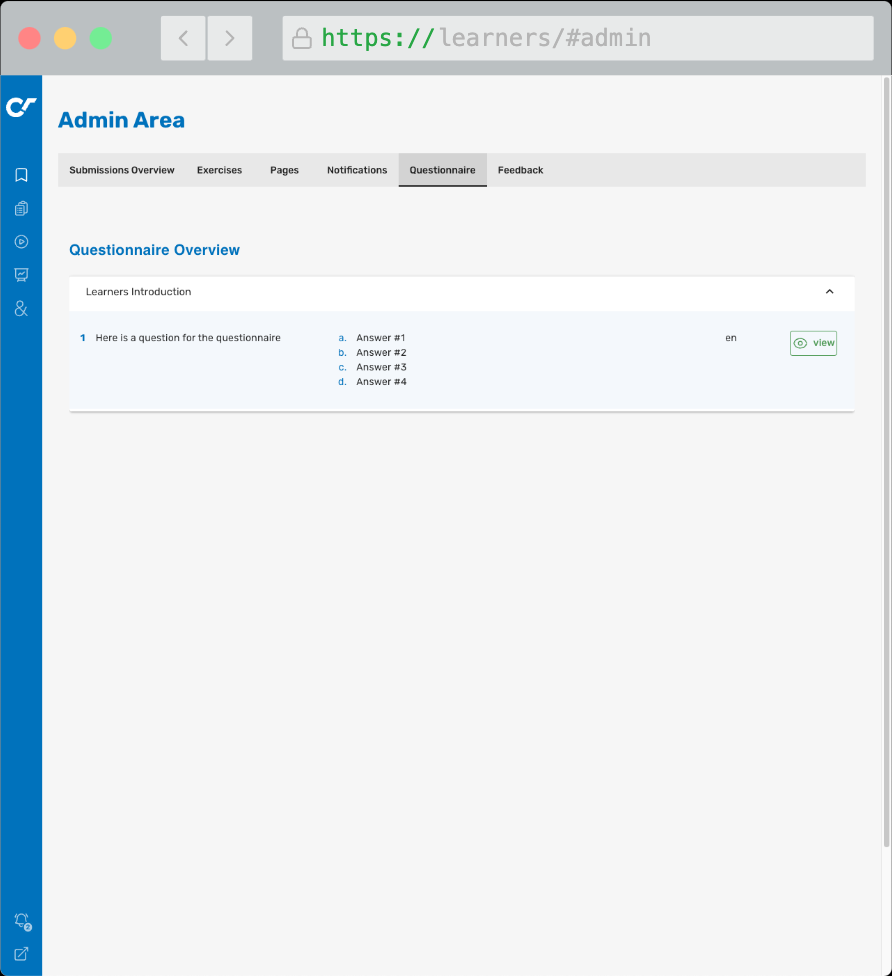

User pop-up:

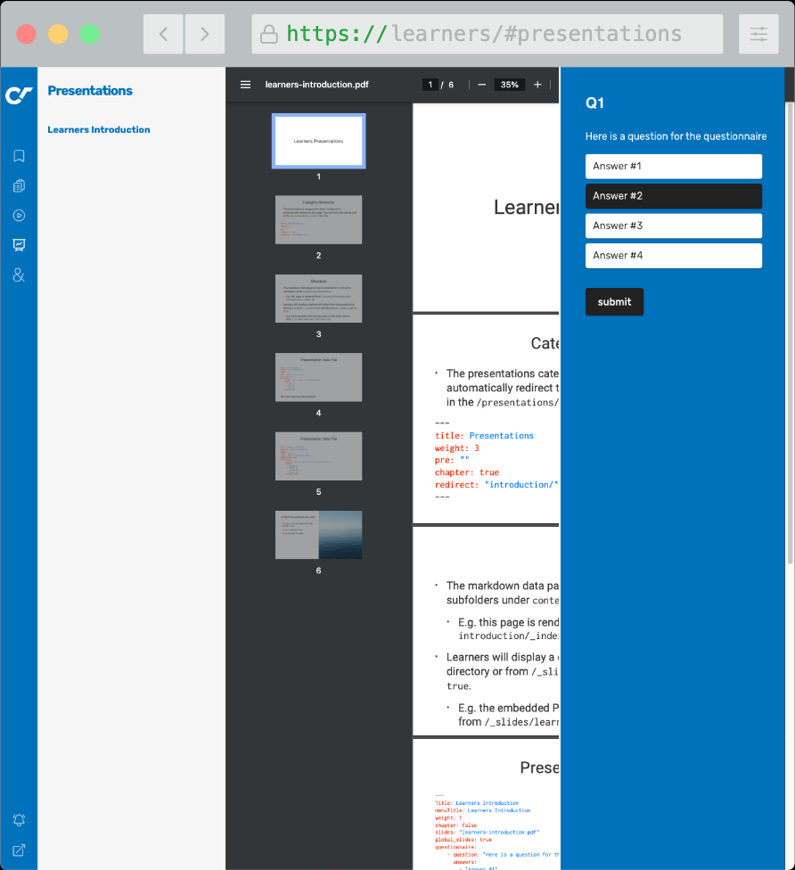

Admin response review:

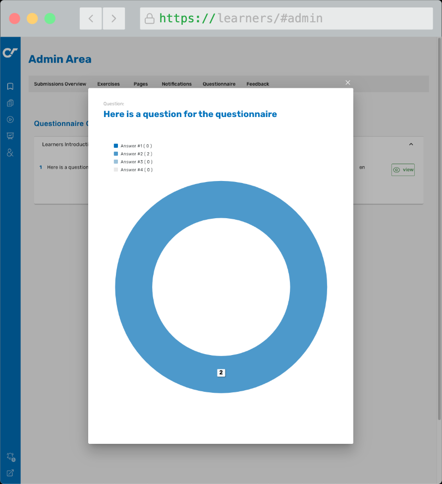

</details>

<details markdown=1>
<summary>Feedback</summary>

The feedback page collects all feedback on course materials and categorises them on a per-material basis. Reviewing submissions allows instructors to address any errors or misunderstandings of the course material. Instructors can deliver this immediately during the course, anonymously based on the feedback received, rather than requesting participants to comment verbally on each module.

Example:

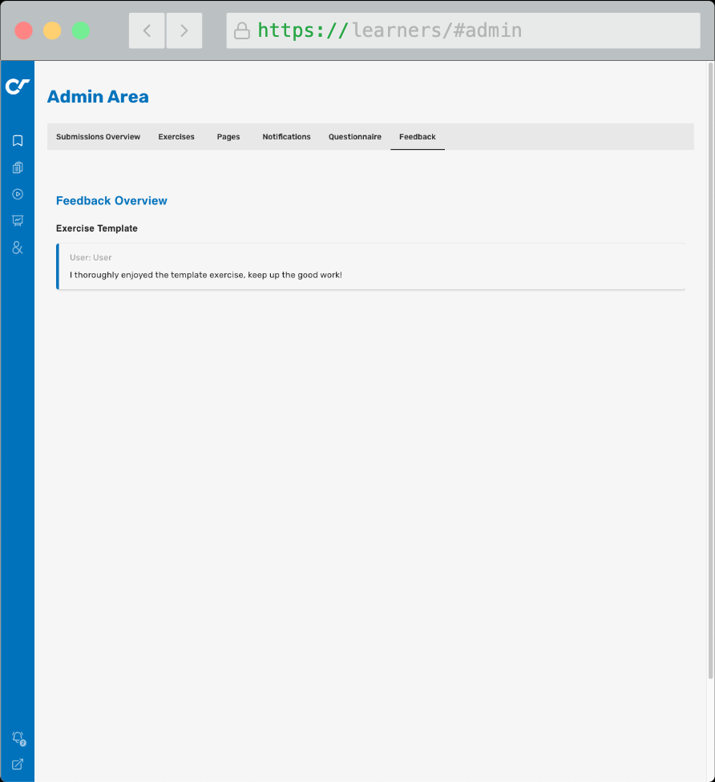

</details>

## License

[](http://creativecommons.org/licenses/by-sa/3.0/igo/)  
This work is licensed under a [Creative Commons Attribution-ShareAlike 3.0 IGO License](http://creativecommons.org/licenses/by-sa/3.0/igo/).
